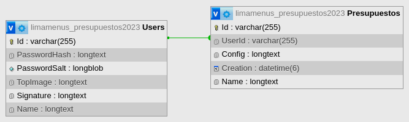

# NetDynamicPress
A backend for DynamicPress

There is no appsettings.json because the connection String is there as in the [Microsoft Docs](https://learn.microsoft.com/en-us/ef/core/miscellaneous/connection-strings). You have to delete the Development in [appsettings.Development.json](appsettings.Development.json).

It is important that the bit size of the key is at least 128 bits


## Relationships and Design

It's really simple, it just has a Relationship 1:N, the User with the Presupuesto's. The user is who create the Presupuesto's:

<div style="width: 100%; display: grid; place-items: center;">
  
</div>

## Models

### 1. Base
The two models inherit from a *Base* class which defines the name and the Id, which is generated automatically with **Guid** in the constructor:

```C#
public class Base
{
    public string Id { get; private set; }
    public string Name { get; set; }

    public Base()
    {
        Id = Guid.NewGuid().ToString();
    }

    public override string ToString()
    {
        return $"{Name},{Id}";
    }
}

```
Also has a ToString method for debugging purposes

### 2. User
The User model saves the navigation prop of the Presupuesto's, and the salt with which the password has been hashed:

```C#
public class User : Base
{
    public string PasswordHash { get; set; }
    public byte[] PasswordSalt { get; set; }
    public string TopImage { get;set; }
    public string Signature { get;set; }

    public virtual IEnumerable<Presupuesto> Presupuestos { get;set; }
}
```

It also saves the top image and the signature, which will be used in all the Presupuesto's

### 3. Presupuesto
The Presupuesto model saves the foreign key from the user, and it saves the **Data config** in a json (it is weakly typed).

```C#

public class Presupuesto : Base
{
    public User User { get;set; }
    public string UserId { get;set; }
    public string Config { get;set; }
    public DateTime Creation { get;set; }

    public Presupuesto()
    {
        Creation = DateTime.UtcNow;
    }
}
```

Also have a Creation prop, that sets the CreationDate with the actual datetime, which is generated in the constructor.

## JWT Implementation
The JWT is implemented with a [service](https://github.com/Abad-Dev/NetDynamicPress/blob/main/Services/JwtService.cs) with the next functions:

### Generate Token(String)
Generates the session token and saves the User Id as a claim "sub" in the token. Returns the token as a string.
```c#
public string GenerateToken(string userId);
```
<br>

### ValidateToken(String)
Returns the Securitytoken of the validated token if it's correct.
```c#
public SecurityToken ValidateToken(string token)
```
<br>

### GetUserIdFromToken(String)
Uses the *ValidateToken* function to validate the token and get its SecurityToken. After that, gets the subject and return it as String. 
```c#
public string GetUserIdFromToken(string token)
```